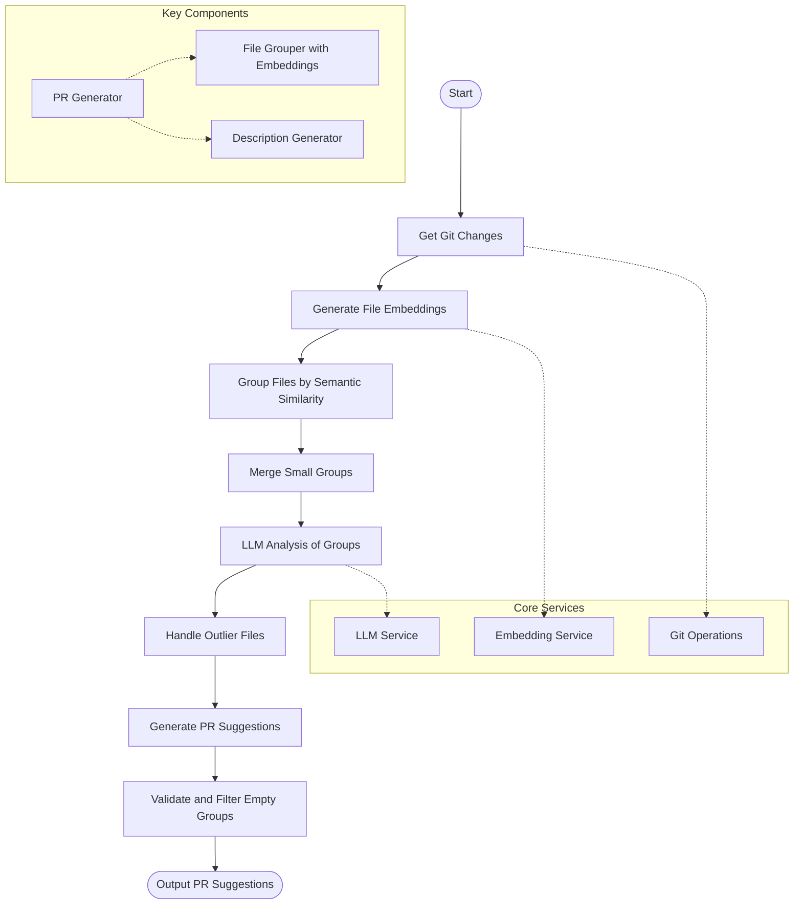

# PR Generator

A tool for automatically generating pull request suggestions from Git changes using LLM-guided strategies.

## Overview

PR Generator analyzes changes in a Git repository and suggests logical groupings for pull requests. It uses a combination of embedding-based similarity analysis and LLM-guided categorization to create meaningful PR suggestions.

This repository contains an LLM-guided approach for PR generation, which is part of a larger project comparing different strategies (LLM-guided, CrewAI, and LangGraph).

## Features

- **Semantic Grouping**: Groups files based on semantic similarity using embeddings
- **Intelligent Chunking**: Token-aware chunking to handle large file sets efficiently
- **LLM-Based Analysis**: Uses language models to understand changes and suggest logical groupings
- **Automatic Branch Name Generation**: Creates meaningful branch names for each PR suggestion
- **Validation and Deduplication**: Validates PR suggestions and removes empty or duplicate groups

## Architecture

The PR Generator implements a modular architecture with several key components:

### Core Components

- **PRGenerator**: The main class that orchestrates the PR generation process
- **FileGrouperWithEmbeddings**: Groups files based on semantic similarity using embeddings
- **LLMService**: Interface to language models for analyzing changes and generating descriptions
- **DescriptionGenerator**: Generates detailed PR descriptions for each group

### Flow Diagram



## Installation

```bash
# Clone the repository
git clone https://github.com/manavgup/pr-generator.git
cd pr-generator

# Create and activate virtual environment
python -m venv venv
source venv/bin/activate  # On Windows: venv\Scripts\activate

# Install dependencies
pip install -r requirements.txt
```

## Usage

```bash
# Run the PR generator on a Git repository
python -m llm_guided_approach.scripts.generate_prs --repo-path /path/to/git/repo --provider openai
```

### Command Line Arguments

- `--repo-path`: Path to the Git repository to analyze
- `--provider`: LLM provider to use (openai or ollama)
- `--model`: Specific model to use (default depends on provider)
- `--api-key`: API key for the LLM provider
- `--base-url`: Base URL for the LLM provider API
- `--verbose`: Enable verbose logging
- `--output-file`: Path to save the PR suggestions JSON

## Configuration

The PR Generator can be configured using environment variables:

- `OPENAI_API_KEY`: API key for OpenAI
- `LLM_PROVIDER`: 'openai' or 'ollama'
- `LLM_MODEL`: Model name (e.g., 'gpt-4o-mini' for OpenAI, 'llama3' for Ollama)
- `LLM_BASE_URL`: Base URL for the LLM provider API
- `LLM_TEMPERATURE`: Temperature for generation (default: 0.7)
- `LLM_MAX_TOKENS`: Maximum tokens for generation

## Example Output

```json
{
  "pr_suggestions": [
    {
      "title": "feat(auth): improve authentication middleware",
      "files": [
        "backend/core/authentication_middleware.py",
        "backend/auth/oidc.py"
      ],
      "rationale": "These files belong together as they implement authentication functionality...",
      "suggested_branch": "feat-auth-improve-middleware",
      "description": "This PR enhances the authentication middleware by..."
    }
  ],
  "total_groups": 1,
  "message": "Created 1 pull request suggestions",
  "validation_result": {
    "valid": true,
    "issues": [],
    "stats": {
      "total_groups": 1,
      "filtered_groups": 0
    }
  }
}
```

## Project Structure

```
llm_guided_approach/
├── __init__.py
├── generators/
│   ├── __init__.py
│   ├── description_generator.py    # Generates detailed PR descriptions
│   ├── file_grouper.py             # Basic file grouping implementation
│   ├── file_grouper_with_embeddings.py  # Embedding-based grouping
│   └── pr_generator.py             # Main PR generation orchestrator
├── llm_service.py                  # LLM client service
├── main.py                         # Entry point
└── scripts/
    ├── generate_prs.py             # Script to run PR generation
    └── output/                     # Output directory for PR suggestions

shared/
├── __init__.py
├── config/
│   ├── __init__.py
│   └── llm_config.py               # LLM configuration
├── git_operations.py               # Git operations helper
├── models/
│   ├── __init__.py
│   └── pr_models.py                # Pydantic models for PR generation
└── utils/
    ├── embedding_utils.py          # Embedding utilities
    └── logging_utils.py            # Logging utilities
```

## Core Logic

The PR Generator follows this logic flow:

1. **Get Changed Files**: Retrieve all changed files from the Git repository
2. **Generate Embeddings**: Create embeddings for file changes to analyze semantic similarity
3. **Group by Similarity**: Group files based on semantic similarity
4. **Process with LLM**: Send grouped files to the LLM for deeper analysis
5. **Chunk Large Groups**: Split large groups into manageable chunks
6. **Generate PR Suggestions**: Create complete PR suggestions with titles, descriptions, and branch names
7. **Validate Results**: Validate and filter empty or invalid groups

## Contributing

Contributions are welcome! Please feel free to submit a Pull Request.

1. Fork the repository
2. Create your feature branch (`git checkout -b feature/amazing-feature`)
3. Commit your changes (`git commit -m 'Add some amazing feature'`)
4. Push to the branch (`git push origin feature/amazing-feature`)
5. Open a Pull Request

## License

This project is licensed under the MIT License - see the LICENSE file for details.

## Acknowledgments

- This project is part of a research effort comparing different approaches to PR generation
- Thanks to the open-source community for their invaluable tools and libraries