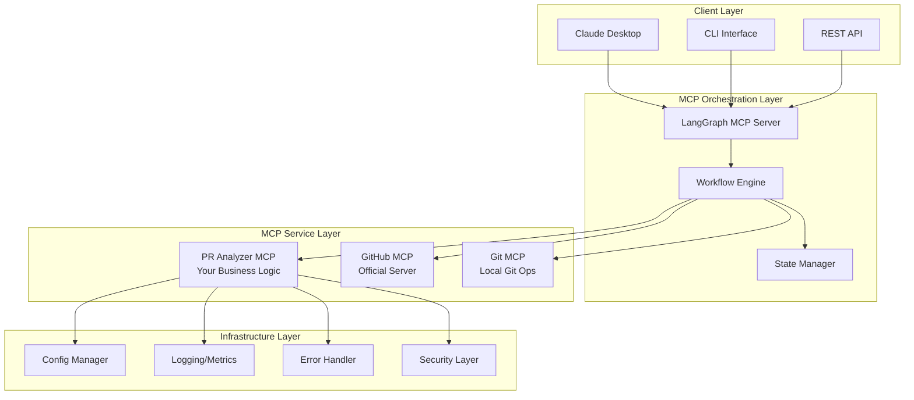

# Complete MCP Implementation Plan for PR Generator

## Architecture Overview



## Phase 1: Foundation (Week 1)

### 1.1 Project Structure Setup
```bash
pr-generator/
├── mcp_servers/
│   ├── pr_analyzer/
│   │   ├── __init__.py
│   │   ├── server.py
│   │   ├── tools/
│   │   │   ├── analyzer.py
│   │   │   ├── grouper.py
│   │   │   └── validator.py
│   │   ├── models/
│   │   │   ├── pr_models.py
│   │   │   └── analysis_models.py
│   │   └── tests/
│   └── shared/
│       ├── state_manager.py
│       ├── error_handler.py
│       └── telemetry.py
├── workflows/
│   ├── langgraph_configs/
│   │   ├── pr_creation.yaml
│   │   └── repo_analysis.yaml
│   └── orchestration/
│       └── workflow_manager.py
├── config/
│   ├── mcp_servers.yaml
│   ├── workflows.yaml
│   └── security.yaml
├── tests/
│   ├── integration/
│   └── unit/
└── docs/
    ├── architecture.md
    └── deployment.md
```

### 1.2 Core MCP Server Implementation
```python
# mcp_servers/pr_analyzer/server.py
from mcp import Server, Tool
from typing import Dict, List, Any
import asyncio

class PRAnalyzerMCPServer(Server):
    def __init__(self):
        super().__init__("pr-analyzer", version="1.0.0")
        self.state_manager = StateManager()
        self.error_handler = ErrorHandler()
        self.telemetry = Telemetry()
        self._register_tools()
    
    def _register_tools(self):
        self.tools = [
            Tool(
                name="analyze_repository",
                description="Analyze uncommitted changes in a repository",
                inputSchema={
                    "type": "object",
                    "properties": {
                        "repo_path": {"type": "string"},
                        "include_untracked": {"type": "boolean", "default": True},
                        "session_id": {"type": "string"}
                    },
                    "required": ["repo_path"]
                }
            ),
            Tool(
                name="suggest_pr_boundaries",
                description="Suggest logical PR boundaries using LLM",
                inputSchema={
                    "type": "object",
                    "properties": {
                        "analysis": {"type": "object"},
                        "strategy": {
                            "type": "string",
                            "enum": ["semantic", "directory", "dependency", "hybrid"]
                        },
                        "max_files_per_pr": {"type": "integer", "default": 30}
                    },
                    "required": ["analysis"]
                }
            ),
            Tool(
                name="validate_pr_groups",
                description="Validate suggested PR groupings",
                inputSchema={
                    "type": "object",
                    "properties": {
                        "groups": {"type": "array"},
                        "validation_rules": {"type": "array"}
                    },
                    "required": ["groups"]
                }
            ),
            Tool(
                name="generate_pr_metadata",
                description="Generate PR titles, descriptions, and labels",
                inputSchema={
                    "type": "object",
                    "properties": {
                        "pr_group": {"type": "object"},
                        "template": {"type": "string", "default": "standard"}
                    },
                    "required": ["pr_group"]
                }
            )
        ]
```

## Phase 2: State & Configuration (Week 1-2)

### 2.1 State Management Implementation
```python
# mcp_servers/shared/state_manager.py
import redis
import json
from typing import Optional, Dict, Any

class StateManager:
    def __init__(self, redis_url: str = "redis://localhost:6379"):
        self.redis = redis.from_url(redis_url)
        self.ttl = 3600  # 1 hour default TTL
    
    async def save_analysis(self, session_id: str, analysis: Dict[str, Any]):
        """Save analysis results for a session"""
        key = f"pr_analyzer:analysis:{session_id}"
        self.redis.setex(key, self.ttl, json.dumps(analysis))
    
    async def get_analysis(self, session_id: str) -> Optional[Dict[str, Any]]:
        """Retrieve analysis results for a session"""
        key = f"pr_analyzer:analysis:{session_id}"
        data = self.redis.get(key)
        return json.loads(data) if data else None
    
    async def save_workflow_state(self, workflow_id: str, state: Dict[str, Any]):
        """Save workflow execution state"""
        key = f"workflow:state:{workflow_id}"
        self.redis.setex(key, self.ttl, json.dumps(state))
```

### 2.2 Configuration Management
```yaml
# config/pr_analyzer_config.yaml
server:
  name: pr-analyzer
  version: 1.0.0
  port: 8080

analysis:
  max_files_per_pr: 30
  max_pr_size_mb: 50
  exclude_patterns:
    - "*.log"
    - "*.tmp"
    - "node_modules/*"
    - ".git/*"

strategies:
  semantic_grouping:
    enabled: true
    llm_model: "gpt-4"
    temperature: 0.3
    prompt_template: "semantic_grouping_v1"
  
  directory_based:
    enabled: true
    max_depth: 3
    min_files_per_dir: 2
  
  dependency_analysis:
    enabled: true
    languages:
      - python
      - javascript
      - typescript

validation_rules:
  - name: size_check
    max_files: 50
    max_size_mb: 100
  - name: conflict_check
    check_dependencies: true
  - name: test_coverage
    require_tests: true
```

## Phase 3: LangGraph Integration (Week 2)

### 3.1 Workflow Definition
```yaml
# workflows/langgraph_configs/pr_creation.yaml
name: pr_creation_workflow
description: Analyze repository and create PRs

nodes:
  - id: analyze_repo
    type: tool
    tool: pr-analyzer.analyze_repository
    inputs:
      repo_path: ${input.repo_path}
      session_id: ${workflow.session_id}
  
  - id: determine_strategy
    type: llm
    model: gpt-4
    prompt: |
      Based on this repository analysis: ${analyze_repo.output}
      Determine the best PR grouping strategy.
      Consider: file count, languages, directory structure
    
  - id: suggest_boundaries
    type: tool
    tool: pr-analyzer.suggest_pr_boundaries
    inputs:
      analysis: ${analyze_repo.output}
      strategy: ${determine_strategy.output.strategy}
  
  - id: validate_groups
    type: tool
    tool: pr-analyzer.validate_pr_groups
    inputs:
      groups: ${suggest_boundaries.output.groups}
  
  - id: create_prs
    type: parallel
    for_each: ${suggest_boundaries.output.groups}
    nodes:
      - id: generate_metadata
        type: tool
        tool: pr-analyzer.generate_pr_metadata
        inputs:
          pr_group: ${item}
      
      - id: create_github_pr
        type: tool
        tool: github.create_pull_request
        inputs:
          title: ${generate_metadata.output.title}
          body: ${generate_metadata.output.body}
          base: main
          head: ${item.branch_name}
          draft: true

edges:
  - from: start
    to: analyze_repo
  - from: analyze_repo
    to: determine_strategy
  - from: determine_strategy
    to: suggest_boundaries
  - from: suggest_boundaries
    to: validate_groups
  - from: validate_groups
    to: create_prs
    condition: ${validate_groups.output.is_valid}
```

### 3.2 LangGraph MCP Server Configuration
```python
# workflows/orchestration/langgraph_setup.py
from langgraph_mcp import LangGraphMCPServer
import yaml

class PRWorkflowManager:
    def __init__(self):
        self.lg_server = self._setup_langgraph_server()
    
    def _setup_langgraph_server(self):
        # Load workflow definitions
        with open("workflows/langgraph_configs/pr_creation.yaml") as f:
            pr_workflow = yaml.safe_load(f)
        
        # Configure LangGraph MCP Server
        config = {
            "graphs": {
                "pr_creation": pr_workflow
            },
            "mcp_servers": {
                "pr-analyzer": {
                    "url": "localhost:8080",
                    "protocol": "grpc"
                },
                "github": {
                    "command": "npx",
                    "args": ["-y", "@github/github-mcp-server"]
                }
            },
            "llm_config": {
                "provider": "openai",
                "model": "gpt-4",
                "api_key": "${OPENAI_API_KEY}"
            }
        }
        
        return LangGraphMCPServer(config)
```

## Phase 4: Error Handling & Observability (Week 2-3)

### 4.1 Error Handling Implementation
```python
# mcp_servers/shared/error_handler.py
from typing import Callable, Any
import asyncio
from functools import wraps
import logging

class MCPError(Exception):
    """Base exception for MCP operations"""
    pass

class ToolExecutionError(MCPError):
    """Error during tool execution"""
    pass

class ConnectionError(MCPError):
    """MCP connection error"""
    pass

class ErrorHandler:
    def __init__(self):
        self.logger = logging.getLogger(__name__)
        self.retry_config = {
            "max_attempts": 3,
            "backoff_factor": 2,
            "max_delay": 30
        }
    
    def with_retry(self, exceptions=(Exception,)):
        """Decorator for automatic retry with exponential backoff"""
        def decorator(func: Callable) -> Callable:
            @wraps(func)
            async def wrapper(*args, **kwargs) -> Any:
                last_exception = None
                delay = 1
                
                for attempt in range(self.retry_config["max_attempts"]):
                    try:
                        return await func(*args, **kwargs)
                    except exceptions as e:
                        last_exception = e
                        if attempt < self.retry_config["max_attempts"] - 1:
                            self.logger.warning(
                                f"Attempt {attempt + 1} failed: {e}. Retrying in {delay}s"
                            )
                            await asyncio.sleep(delay)
                            delay = min(
                                delay * self.retry_config["backoff_factor"],
                                self.retry_config["max_delay"]
                            )
                        else:
                            self.logger.error(f"All attempts failed: {e}")
                
                raise last_exception
            return wrapper
        return decorator
    
    async def handle_tool_error(self, tool_name: str, error: Exception):
        """Centralized tool error handling"""
        error_context = {
            "tool": tool_name,
            "error_type": type(error).__name__,
            "error_message": str(error)
        }
        
        self.logger.error(f"Tool error: {error_context}")
        
        # Send to monitoring system
        await self.send_to_monitoring(error_context)
        
        # Determine if error is recoverable
        if isinstance(error, ConnectionError):
            raise MCPError("Connection lost. Please retry.")
        else:
            raise ToolExecutionError(f"Tool {tool_name} failed: {error}")
```

### 4.2 Telemetry & Monitoring
```python
# mcp_servers/shared/telemetry.py
from prometheus_client import Counter, Histogram, Gauge
import structlog
from opentelemetry import trace
from opentelemetry.exporter.otlp.proto.grpc.trace_exporter import OTLPSpanExporter

class Telemetry:
    def __init__(self):
        self.logger = structlog.get_logger()
        self.tracer = trace.get_tracer(__name__)
        
        # Metrics
        self.tool_calls = Counter(
            'mcp_tool_calls_total',
            'Total number of MCP tool calls',
            ['tool_name', 'status']
        )
        
        self.tool_duration = Histogram(
            'mcp_tool_duration_seconds',
            'Duration of MCP tool calls',
            ['tool_name']
        )
        
        self.active_sessions = Gauge(
            'mcp_active_sessions',
            'Number of active MCP sessions'
        )
    
    def track_tool_call(self, tool_name: str):
        """Decorator to track tool calls"""
        def decorator(func):
            async def wrapper(*args, **kwargs):
                with self.tracer.start_as_current_span(f"tool:{tool_name}") as span:
                    span.set_attribute("tool.name", tool_name)
                    
                    with self.tool_duration.labels(tool_name=tool_name).time():
                        try:
                            result = await func(*args, **kwargs)
                            self.tool_calls.labels(
                                tool_name=tool_name,
                                status="success"
                            ).inc()
                            span.set_status(trace.Status(trace.StatusCode.OK))
                            return result
                        except Exception as e:
                            self.tool_calls.labels(
                                tool_name=tool_name,
                                status="error"
                            ).inc()
                            span.record_exception(e)
                            span.set_status(
                                trace.Status(trace.StatusCode.ERROR, str(e))
                            )
                            raise
            return wrapper
        return decorator
```

## Phase 5: Security & Authentication (Week 3)

### 5.1 Security Layer Implementation
```python
# mcp_servers/shared/security.py
import jwt
from typing import Dict, Optional
import asyncio
from functools import wraps

class SecurityManager:
    def __init__(self, config_path: str):
        self.config = self._load_config(config_path)
        self.public_key = self._load_public_key()
        self.allowed_tools = self.config.get("allowed_tools", {})
    
    def authenticate_token(self, token: str) -> Dict[str, Any]:
        """Validate JWT token"""
        try:
            payload = jwt.decode(
                token,
                self.public_key,
                algorithms=["RS256"]
            )
            return payload
        except jwt.InvalidTokenError as e:
            raise AuthenticationError(f"Invalid token: {e}")
    
    def authorize_tool_access(self, user_id: str, tool_name: str) -> bool:
        """Check if user can access specific tool"""
        user_roles = self._get_user_roles(user_id)
        tool_requirements = self.allowed_tools.get(tool_name, {})
        
        required_roles = tool_requirements.get("roles", [])
        return any(role in user_roles for role in required_roles)
    
    def secure_tool(self, tool_name: str):
        """Decorator to secure tool access"""
        def decorator(func):
            @wraps(func)
            async def wrapper(self, *args, **kwargs):
                # Extract auth context from MCP request
                auth_context = kwargs.get("_mcp_auth_context", {})
                user_id = auth_context.get("user_id")
                
                if not user_id:
                    raise AuthenticationError("No authentication provided")
                
                if not self.authorize_tool_access(user_id, tool_name):
                    raise AuthorizationError(
                        f"User {user_id} not authorized for tool {tool_name}"
                    )
                
                return await func(self, *args, **kwargs)
            return wrapper
        return decorator
```

### 5.2 Security Configuration
```yaml
# config/security.yaml
authentication:
  provider: jwt
  public_key_path: /secrets/jwt_public.pem
  issuer: "pr-generator-auth"
  audience: "pr-generator-mcp"

authorization:
  default_policy: deny
  
  tool_permissions:
    analyze_repository:
      roles: ["developer", "admin"]
      scopes: ["repo:read"]
    
    suggest_pr_boundaries:
      roles: ["developer", "admin"]
      scopes: ["repo:read", "ai:use"]
    
    create_pull_request:
      roles: ["developer", "admin"]
      scopes: ["repo:write", "pr:create"]
  
  rate_limits:
    - role: developer
      requests_per_hour: 100
    - role: admin
      requests_per_hour: 1000

audit:
  enabled: true
  log_level: info
  sensitive_fields:
    - auth_token
    - api_key
```

## Phase 6: API & Client Interfaces (Week 3-4)

### 6.1 REST API Gateway
```python
# api/gateway.py
from fastapi import FastAPI, HTTPException, Depends
from fastapi.security import HTTPBearer
import httpx

app = FastAPI(title="PR Generator API")
security = HTTPBearer()

class APIGateway:
    def __init__(self):
        self.mcp_client = MCPClient("langgraph-mcp")
        self.security_manager = SecurityManager("config/security.yaml")
    
    async def analyze_repository(
        self,
        repo_path: str,
        token: str = Depends(security)
    ):
        """Analyze repository endpoint"""
        # Validate token
        user_context = self.security_manager.authenticate_token(token.credentials)
        
        # Execute workflow via LangGraph MCP
        result = await self.mcp_client.invoke_workflow(
            "pr_creation_workflow",
            {
                "repo_path": repo_path,
                "user_id": user_context["user_id"]
            }
        )
        
        return {
            "status": "success",
            "workflow_id": result["workflow_id"],
            "result": result["output"]
        }

gateway = APIGateway()

@app.post("/analyze")
async def analyze_repo(
    repo_path: str,
    token: str = Depends(security)
):
    return await gateway.analyze_repository(repo_path, token)

@app.get("/workflow/{workflow_id}/status")
async def get_workflow_status(
    workflow_id: str,
    token: str = Depends(security)
):
    return await gateway.get_workflow_status(workflow_id, token)
```

### 6.2 CLI Interface
```python
# cli/pr_generator_cli.py
import click
import asyncio
from mcp.client import MCPClient
import json

class PRGeneratorCLI:
    def __init__(self):
        self.mcp_client = MCPClient("langgraph-mcp")
    
    async def analyze_repo(self, repo_path: str, output_format: str):
        """Analyze repository via CLI"""
        result = await self.mcp_client.invoke_workflow(
            "pr_creation_workflow",
            {"repo_path": repo_path}
        )
        
        if output_format == "json":
            click.echo(json.dumps(result, indent=2))
        else:
            self._print_human_readable(result)
    
    def _print_human_readable(self, result):
        """Format result for human reading"""
        click.echo(f"Analysis completed!")
        click.echo(f"Found {len(result['pr_groups'])} potential PRs:")
        
        for i, group in enumerate(result['pr_groups']):
            click.echo(f"\nPR {i+1}: {group['title']}")
            click.echo(f"Files: {len(group['files'])}")
            click.echo(f"Description: {group['description'][:100]}...")

cli = PRGeneratorCLI()

@click.command()
@click.argument('repo_path')
@click.option('--format', default='human', help='Output format (json/human)')
@click.option('--create-prs', is_flag=True, help='Actually create PRs on GitHub')
def analyze(repo_path, format, create_prs):
    """Analyze repository and suggest PRs"""
    asyncio.run(cli.analyze_repo(repo_path, format))

if __name__ == '__main__':
    analyze()
```

## Phase 7: Testing & Quality Assurance (Week 4)

### 7.1 Integration Tests
```python
# tests/integration/test_full_workflow.py
import pytest
import asyncio
from mcp.testing import MCPTestClient
import tempfile
import git

class TestPRGeneratorWorkflow:
    @pytest.fixture
    async def test_client(self):
        """Create test client with mock MCP servers"""
        return MCPTestClient({
            "pr-analyzer": "mcp_servers.pr_analyzer.server:PRAnalyzerMCPServer",
            "github": MockGitHubServer(),
            "langgraph": MockLangGraphServer()
        })
    
    @pytest.fixture
    def test_repo(self):
        """Create test repository with changes"""
        with tempfile.TemporaryDirectory() as tmpdir:
            repo = git.Repo.init(tmpdir)
            
            # Create test files
            files = {
                "src/main.py": "def main():\n    pass",
                "src/utils.py": "def helper():\n    pass",
                "tests/test_main.py": "def test_main():\n    pass",
                "README.md": "# Test Project"
            }
            
            for path, content in files.items():
                file_path = os.path.join(tmpdir, path)
                os.makedirs(os.path.dirname(file_path), exist_ok=True)
                with open(file_path, 'w') as f:
                    f.write(content)
            
            yield tmpdir
    
    @pytest.mark.asyncio
    async def test_complete_workflow(self, test_client, test_repo):
        """Test complete PR generation workflow"""
        result = await test_client.invoke_workflow(
            "pr_creation_workflow",
            {"repo_path": test_repo}
        )
        
        assert result["status"] == "success"
        assert len(result["pr_groups"]) > 0
        
        # Verify PR structure
        for pr in result["pr_groups"]:
            assert "title" in pr
            assert "description" in pr
            assert "files" in pr
            assert len(pr["files"]) > 0
    
    @pytest.mark.asyncio
    async def test_error_handling(self, test_client):
        """Test error handling for invalid repository"""
        with pytest.raises(ToolExecutionError):
            await test_client.invoke_workflow(
                "pr_creation_workflow",
                {"repo_path": "/invalid/path"}
            )
```

### 7.2 Performance Tests
```python
# tests/performance/test_scalability.py
import pytest
import asyncio
import time
from concurrent.futures import ThreadPoolExecutor

class TestScalability:
    @pytest.mark.asyncio
    async def test_concurrent_workflows(self, test_client, large_test_repo):
        """Test handling multiple concurrent workflows"""
        num_workflows = 10
        
        async def run_workflow(index):
            start_time = time.time()
            result = await test_client.invoke_workflow(
                "pr_creation_workflow",
                {"repo_path": f"{large_test_repo}_{index}"}
            )
            duration = time.time() - start_time
            return duration
        
        # Run workflows concurrently
        tasks = [run_workflow(i) for i in range(num_workflows)]
        durations = await asyncio.gather(*tasks)
        
        # Verify performance
        avg_duration = sum(durations) / len(durations)
        assert avg_duration < 30  # Should complete in under 30 seconds
        
        # Check for memory leaks
        import psutil
        process = psutil.Process()
        memory_usage = process.memory_info().rss / 1024 / 1024  # MB
        assert memory_usage < 500  # Should not exceed 500MB
```

## Phase 8: Deployment & Operations (Week 4-5)

### 8.1 Docker Configuration
```dockerfile
# Dockerfile.pr-analyzer
FROM python:3.11-slim

WORKDIR /app

# Install dependencies
COPY requirements.txt .
RUN pip install --no-cache-dir -r requirements.txt

# Copy application code
COPY mcp_servers/pr_analyzer ./mcp_servers/pr_analyzer
COPY mcp_servers/shared ./mcp_servers/shared
COPY config ./config

# Set environment variables
ENV PYTHONPATH=/app
ENV MCP_SERVER_NAME=pr-analyzer

# Health check
HEALTHCHECK --interval=30s --timeout=3s --start-period=5s --retries=3 \
  CMD python -c "import requests; requests.get('http://localhost:8080/health')"

# Run the server
CMD ["python", "-m", "mcp_servers.pr_analyzer.server"]
```

### 8.2 Kubernetes Deployment
```yaml
# k8s/deployment.yaml
apiVersion: apps/v1
kind: Deployment
metadata:
  name: pr-analyzer-mcp
spec:
  replicas: 3
  selector:
    matchLabels:
      app: pr-analyzer-mcp
  template:
    metadata:
      labels:
        app: pr-analyzer-mcp
    spec:
      containers:
      - name: pr-analyzer
        image: pr-generator/pr-analyzer:latest
        ports:
        - containerPort: 8080
        env:
        - name: REDIS_URL
          valueFrom:
            secretKeyRef:
              name: pr-analyzer-secrets
              key: redis-url
        - name: OPENAI_API_KEY
          valueFrom:
            secretKeyRef:
              name: pr-analyzer-secrets
              key: openai-api-key
        resources:
          requests:
            memory: "256Mi"
            cpu: "250m"
          limits:
            memory: "512Mi"
            cpu: "500m"
        livenessProbe:
          httpGet:
            path: /health
            port: 8080
          initialDelaySeconds: 10
          periodSeconds: 30
---
apiVersion: v1
kind: Service
metadata:
  name: pr-analyzer-mcp-service
spec:
  selector:
    app: pr-analyzer-mcp
  ports:
  - port: 8080
    targetPort: 8080
  type: ClusterIP
```

### 8.3 Monitoring & Alerting
```yaml
# monitoring/prometheus-rules.yaml
groups:
  - name: pr_analyzer_alerts
    interval: 30s
    rules:
      - alert: HighErrorRate
        expr: rate(mcp_tool_calls_total{status="error"}[5m]) > 0.1
        for: 5m
        labels:
          severity: warning
        annotations:
          summary: "High error rate for MCP tool calls"
          description: "Error rate is {{ $value }} errors per second"
      
      - alert: SlowToolExecution
        expr: histogram_quantile(0.95, mcp_tool_duration_seconds) > 10
        for: 5m
        labels:
          severity: warning
        annotations:
          summary: "Slow tool execution detected"
          description: "95th percentile latency is {{ $value }} seconds"
      
      - alert: MemoryLeak
        expr: process_resident_memory_bytes > 1073741824  # 1GB
        for: 10m
        labels:
          severity: critical
        annotations:
          summary: "Possible memory leak detected"
          description: "Memory usage is {{ $value }} bytes"
```

### 8.4 Grafana Dashboard Configuration
```json
{
  "dashboard": {
    "title": "PR Generator MCP Dashboard",
    "panels": [
      {
        "title": "Tool Call Rate",
        "targets": [
          {
            "expr": "rate(mcp_tool_calls_total[5m])",
            "legendFormat": "{{ tool_name }} - {{ status }}"
          }
        ]
      },
      {
        "title": "Tool Execution Time",
        "targets": [
          {
            "expr": "histogram_quantile(0.95, mcp_tool_duration_seconds)",
            "legendFormat": "95th percentile - {{ tool_name }}"
          }
        ]
      },
      {
        "title": "Active Sessions",
        "targets": [
          {
            "expr": "mcp_active_sessions"
          }
        ]
      },
      {
        "title": "Workflow Success Rate",
        "targets": [
          {
            "expr": "rate(workflow_completions_total{status='success'}[5m]) / rate(workflow_completions_total[5m])"
          }
        ]
      }
    ]
  }
}
```

## Phase 9: Documentation & Training (Week 5)

### 9.1 API Documentation
```yaml
# docs/api/openapi.yaml
openapi: 3.0.0
info:
  title: PR Generator API
  version: 1.0.0
  description: API for automated PR generation

paths:
  /analyze:
    post:
      summary: Analyze repository for PR suggestions
      security:
        - bearerAuth: []
      requestBody:
        required: true
        content:
          application/json:
            schema:
              type: object
              properties:
                repo_path:
                  type: string
                  description: Path to the repository
                options:
                  type: object
                  properties:
                    strategy:
                      type: string
                      enum: [semantic, directory, dependency, hybrid]
                    max_files_per_pr:
                      type: integer
                      default: 30
      responses:
        200:
          description: Successful analysis
          content:
            application/json:
              schema:
                type: object
                properties:
                  workflow_id:
                    type: string
                  status:
                    type: string
                  pr_groups:
                    type: array
                    items:
                      $ref: '#/components/schemas/PRGroup'

components:
  schemas:
    PRGroup:
      type: object
      properties:
        id:
          type: string
        title:
          type: string
        description:
          type: string
        files:
          type: array
          items:
            type: string
        labels:
          type: array
          items:
            type: string
```

### 9.2 User Guide
```markdown
# PR Generator User Guide

## Quick Start

### 1. Using Claude Desktop
```bash
# In Claude Desktop, after configuring the MCP server:
"Analyze my repository at /path/to/repo and suggest PR groupings"
"Create draft PRs for the suggested groupings"
```

### 2. Using CLI
```bash
# Install CLI
pip install pr-generator-cli

# Analyze repository
pr-gen analyze /path/to/repo

# Create PRs
pr-gen analyze /path/to/repo --create-prs
```

### 3. Using API
```python
import requests

# Authenticate
headers = {"Authorization": f"Bearer {token}"}

# Analyze repository
response = requests.post(
    "https://api.pr-generator.com/analyze",
    json={"repo_path": "/path/to/repo"},
    headers=headers
)

result = response.json()
print(f"Found {len(result['pr_groups'])} potential PRs")
```

## Configuration Options

### Strategy Selection
- `semantic`: Groups files based on semantic similarity
- `directory`: Groups by directory structure
- `dependency`: Analyzes code dependencies
- `hybrid`: Combines multiple strategies

### Advanced Options
```yaml
analysis:
  max_files_per_pr: 30
  exclude_patterns:
    - "*.log"
    - "node_modules/*"
  include_tests: true
  require_description: true
```

## Best Practices

1. **Start with Analysis Only**
   - Review suggestions before creating PRs
   - Adjust parameters based on results

2. **Use Appropriate Strategies**
   - Small projects: `directory`
   - Large codebases: `semantic` or `hybrid`
   - Monorepos: `dependency`

3. **Review Generated PRs**
   - Always create as drafts first
   - Review and edit descriptions
   - Ensure tests are included
```

### 9.3 Developer Documentation
```markdown
# Developer Guide

## Architecture Overview

The PR Generator uses a microservices architecture with MCP:

1. **PR Analyzer MCP Server**: Core business logic
2. **LangGraph MCP Server**: Workflow orchestration
3. **GitHub MCP Server**: GitHub operations

## Adding New Features

### 1. Adding a New Tool
```python
# mcp_servers/pr_analyzer/tools/custom_tool.py
from mcp import Tool

class CustomTool(Tool):
    def __init__(self):
        super().__init__(
            name="custom_analysis",
            description="Custom analysis tool",
            inputSchema={...}
        )
    
    async def execute(self, params):
        # Implementation
        return result
```

### 2. Creating New Workflows
```yaml
# workflows/langgraph_configs/custom_workflow.yaml
name: custom_workflow
nodes:
  - id: custom_step
    type: tool
    tool: pr-analyzer.custom_analysis
```

## Testing

### Unit Tests
```python
pytest tests/unit/
```

### Integration Tests
```python
pytest tests/integration/
```

### Performance Tests
```python
pytest tests/performance/ --benchmark
```

## Deployment

### Local Development
```bash
docker-compose up
```

### Production
```bash
kubectl apply -f k8s/
```
```

## Phase 10: Optimization & Scaling (Week 6)

### 10.1 Performance Optimizations
```python
# mcp_servers/shared/optimizations.py
import asyncio
from functools import lru_cache
from typing import Dict, Any
import aiocache

class PerformanceOptimizer:
    def __init__(self):
        self.cache = aiocache.Cache(aiocache.SimpleMemoryCache)
        self.connection_pool = ConnectionPool(max_size=100)
    
    @lru_cache(maxsize=1000)
    def get_cached_analysis(self, repo_path: str, commit_hash: str):
        """Cache analysis results by commit hash"""
        return self._perform_analysis(repo_path, commit_hash)
    
    async def batch_process_files(self, files: List[str], batch_size: int = 50):
        """Process files in batches for efficiency"""
        batches = [files[i:i + batch_size] for i in range(0, len(files), batch_size)]
        
        tasks = []
        for batch in batches:
            task = asyncio.create_task(self._process_batch(batch))
            tasks.append(task)
        
        results = await asyncio.gather(*tasks)
        return [item for batch in results for item in batch]
    
    async def get_connection(self, server_name: str):
        """Get connection from pool"""
        return await self.connection_pool.get(server_name)
```

### 10.2 Horizontal Scaling Configuration
```yaml
# k8s/horizontal-autoscaler.yaml
apiVersion: autoscaling/v2
kind: HorizontalPodAutoscaler
metadata:
  name: pr-analyzer-hpa
spec:
  scaleTargetRef:
    apiVersion: apps/v1
    kind: Deployment
    name: pr-analyzer-mcp
  minReplicas: 2
  maxReplicas: 10
  metrics:
  - type: Resource
    resource:
      name: cpu
      target:
        type: Utilization
        averageUtilization: 70
  - type: Resource
    resource:
      name: memory
      target:
        type: Utilization
        averageUtilization: 80
  - type: Pods
    pods:
      metric:
        name: mcp_active_sessions
      target:
        type: AverageValue
        averageValue: "30"
```

## Implementation Timeline

### Week 1: Foundation
- [x] Set up project structure
- [x] Implement basic MCP server
- [x] Create state management
- [x] Set up configuration

### Week 2: Core Features
- [x] Implement analysis tools
- [x] Add PR suggestion logic
- [x] Integrate LangGraph
- [x] Create workflows

### Week 3: Infrastructure
- [x] Add error handling
- [x] Implement security
- [x] Set up monitoring
- [x] Create logging

### Week 4: Integration
- [ ] Build API gateway
- [ ] Create CLI interface
- [ ] Add authentication
- [ ] Test workflows

### Week 5: Testing & Documentation
- [ ] Write unit tests
- [ ] Create integration tests
- [ ] Write documentation
- [ ] Performance testing

### Week 6: Deployment & Optimization
- [ ] Docker setup
- [ ] Kubernetes deployment
- [ ] Performance optimization
- [ ] Production readiness

## Success Metrics

### Technical Metrics
- API response time < 2 seconds
- Workflow completion rate > 95%
- Error rate < 1%
- Availability > 99.9%

### Business Metrics
- Developer adoption rate
- Time saved per PR
- PR quality improvement
- User satisfaction score

## Risk Mitigation

### Technical Risks
1. **LLM API Failures**
   - Mitigation: Multi-provider fallback, response caching
   
2. **Scalability Issues**
   - Mitigation: Horizontal scaling, performance monitoring

3. **Security Vulnerabilities**
   - Mitigation: Regular security audits, penetration testing

### Operational Risks
1. **Cost Overruns**
   - Mitigation: Usage monitoring, rate limiting

2. **Adoption Challenges**
   - Mitigation: Comprehensive documentation, training sessions

## Conclusion

This comprehensive plan provides:

1. **Complete Architecture**: All components identified and designed
2. **Phased Implementation**: Clear weekly milestones
3. **Production-Ready**: Security, monitoring, scaling included
4. **Future-Proof**: Extensible design for new features

The architecture leverages:
- **Your MCP Server**: For unique PR analysis logic
- **LangGraph MCP**: For flexible workflow orchestration
- **GitHub MCP**: For GitHub operations
- **CrewAI Experience**: Ported to modern MCP architecture

This approach gives you the best of all worlds while maintaining backward compatibility and enabling future growth.
