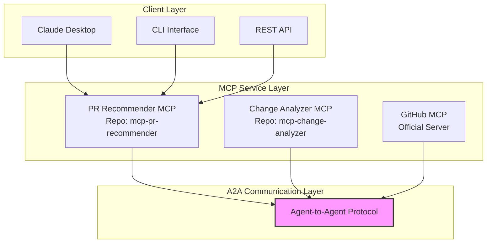
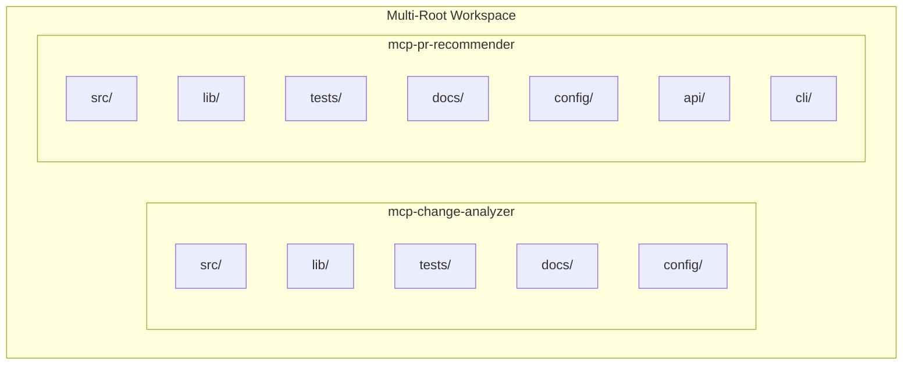

# Revised MCP Implementation Plan for PR Generator (A2A-Based Multi-Repo)

## Architecture Overview



## Multi-Root Workspace Structure

The project will be organized as a multi-root workspace with fully independent repositories:



## Repository Structure

The project will be split into completely independent repositories:

1. **mcp-change-analyzer**: Git change analysis MCP server (Agent)
2. **mcp-pr-recommender**: PR recommendation and generation MCP server (Agent and Primary Entry Point)

Each repository will be fully self-contained with its own implementation of common functionality to ensure true independence.

## Progress Tracking

### Completed Tasks
- Initialized local Git repositories for `mcp-change-analyzer` and `mcp-pr-recommender`.
- Connected local repositories to remote GitHub repositories.
- Created initial project files for both MCP servers including config loaders, state managers, error handlers, telemetry monitors, models, tools, services, registries, and server entry points.

### In-Progress Tasks
- None currently; ready to proceed with further development or testing.

### Pending Tasks
- Continue building out the `mcp-pr-recommender` server features.
- Implement API and CLI interfaces for the PR Recommender.
- Develop unit, integration, and end-to-end tests.
- Create comprehensive documentation and deployment configurations.
- Migrate relevant models from `crewai_approach/models` and `shared/models` to `mcp-pr-recommender` and `mcp-change-analyzer`.
- Refactor and move PR recommendation models to `mcp-pr-recommender/src/lib/models/recommender_models.py`.
- Refactor and move git and directory related models to `mcp-change-analyzer/src/lib/models/git_models.py`.

### Notes and Comments
- The multi-root workspace is fully configured with independent MCP servers.
- Each server is designed to be self-contained with no shared dependencies.
- The architecture supports A2A protocol integration for agent communication.

## Phase 1: Workspace and Repository Setup (Week 1)

### 1.1 Multi-Root Workspace Configuration

Create a VS Code multi-root workspace configuration file:

```json
// pr-generator.code-workspace
{
  "folders": [
    {
      "name": "Git Analyzer",
      "path": "../mcp-git-analyzer"
    },
    {
      "name": "PR Recommender",
      "path": "../mcp-pr-recommender"
    }
  ],
  "settings": {
    "python.linting.enabled": true,
    "python.linting.flake8Enabled": true,
    "python.formatting.provider": "black",
    "editor.formatOnSave": true,
    "editor.rulers": [88],
    "python.testing.pytestEnabled": true,
    "terminal.integrated.env.linux": {
      "PYTHONPATH": "${workspaceFolder}"
    }
  },
  "extensions": {
    "recommendations": [
      "ms-python.python",
      "ms-python.vscode-pylance",
      "ms-python.flake8",
      "ms-python.black-formatter",
      "ms-python.isort"
    ]
  }
}
```

### 1.2 Repository Creation

Initialize the two separate GitHub repositories with the following structure:

```bash
# mcp-change-analyzer
mcp-change-analyzer/
├── src/
│   ├── server.py                  # Main entry point with A2A integration
│   ├── tools/
│   │   ├── repo_analyzer.py       # Tool for analyzing repos
│   │   ├── change_detector.py     # Tool for detecting changes
│   │   └── metrics_collector.py   # Tool for collecting metrics
│   ├── resources/
│   │   ├── repo_structure.py      # Resource for repo structure
│   │   └── change_metadata.py     # Resource for change metadata
│   ├── services/
│   │   ├── git_service.py         # Git operations service
│   │   └── analysis_service.py    # Analysis service
│   ├── lib/                       # Self-contained library code (no shared dependencies)
│   │   ├── state/
│   │   │   └── manager.py         # State management
│   │   ├── error/
│   │   │   └── handler.py         # Error handling
│   │   ├── telemetry/
│   │   │   └── monitor.py         # Telemetry
│   │   └── models/
│   │       └── git_models.py      # Git-specific models
│   └── config/
│       └── loader.py              # Configuration loader
├── tests/
│   ├── unit/
│   └── integration/
├── docs/
│   ├── api.md                     # API documentation
│   └── usage.md                   # Usage documentation
├── config/
│   └── server.yaml                # Server configuration
├── pyproject.toml                 # Project configuration
├── requirements.txt               # Dependencies
├── requirements-dev.txt           # Development dependencies
├── .gitignore                     # Git ignore file
├── README.md                      # Project readme
└── setup.py                       # Package setup

# mcp-pr-recommender
mcp-pr-recommender/
├── src/
│   ├── server.py                  # Main entry point with A2A integration
│   ├── tools/
│   │   ├── grouper.py             # Tool for grouping files
│   │   ├── validator.py           # Tool for validating PRs
│   │   └── metadata_generator.py  # Tool for generating PR metadata
│   ├── resources/
│   │   ├── grouping_strategies.py # Resource for grouping strategies
│   │   └── pr_templates.py        # Resource for PR templates
│   ├── services/
│   │   ├── grouping_service.py    # Grouping service
│   │   └── validation_service.py  # Validation service
│   ├── lib/                       # Self-contained library code (no shared dependencies)
│   │   ├── state/
│   │   │   └── manager.py         # State management
│   │   ├── error/
│   │   │   └── handler.py         # Error handling
│   │   ├── telemetry/
│   │   │   └── monitor.py         # Telemetry
│   │   └── models/
│   │       └── pr_models.py       # PR-specific models
│   ├── api/
│   │   └── gateway.py             # API gateway
│   ├── cli/
│   │   └── pr_generator_cli.py    # CLI interface
│   └── config/
│       └── loader.py              # Configuration loader
├── tests/
│   ├── unit/
│   └── integration/
├── docs/
│   ├── api.md                     # API documentation
│   └── usage.md                   # Usage documentation
├── config/
│   └── server.yaml                # Server configuration
├── pyproject.toml                 # Project configuration
├── requirements.txt               # Dependencies
├── requirements-dev.txt           # Development dependencies
├── .gitignore                     # Git ignore file
├── README.md                      # Project readme
└── setup.py                       # Package setup

## Phase 1: Workspace and Repository Setup (Week 1)

### 1.1 Multi-Root Workspace Configuration

Create a VS Code multi-root workspace configuration file:

```json
// pr-generator.code-workspace
{
  "folders": [
    {
      "name": "Git Analyzer",
      "path": "../mcp-git-analyzer"
    },
    {
      "name": "PR Recommender",
      "path": "../mcp-pr-recommender"
    }
  ],
  "settings": {
    "python.linting.enabled": true,
    "python.linting.flake8Enabled": true,
    "python.formatting.provider": "black",
    "editor.formatOnSave": true,
    "editor.rulers": [88],
    "python.testing.pytestEnabled": true,
    "terminal.integrated.env.linux": {
      "PYTHONPATH": "${workspaceFolder}"
    }
  },
  "extensions": {
    "recommendations": [
      "ms-python.python",
      "ms-python.vscode-pylance",
      "ms-python.flake8",
      "ms-python.black-formatter",
      "ms-python.isort"
    ]
  }
}
```

### 1.2 Repository Creation

Initialize the two separate GitHub repositories with the following structure:

```bash
# mcp-change-analyzer
mcp-change-analyzer/
├── src/
│   ├── server.py                  # Main entry point with A2A integration
│   ├── tools/
│   │   ├── repo_analyzer.py       # Tool for analyzing repos
│   │   ├── change_detector.py     # Tool for detecting changes
│   │   └── metrics_collector.py   # Tool for collecting metrics
│   ├── resources/
│   │   ├── repo_structure.py      # Resource for repo structure
│   │   └── change_metadata.py     # Resource for change metadata
│   ├── services/
│   │   ├── git_service.py         # Git operations service
│   │   └── analysis_service.py    # Analysis service
│   ├── lib/                       # Self-contained library code (no shared dependencies)
│   │   ├── state/
│   │   │   └── manager.py         # State management
│   │   ├── error/
│   │   │   └── handler.py         # Error handling
│   │   ├── telemetry/
│   │   │   └── monitor.py         # Telemetry
│   │   └── models/
│   │       └── git_models.py      # Git-specific models
│   └── config/
│       └── loader.py              # Configuration loader
├── tests/
│   ├── unit/
│   └── integration/
├── docs/
│   ├── api.md                     # API documentation
│   └── usage.md                   # Usage documentation
├── config/
│   └── server.yaml                # Server configuration
├── pyproject.toml                 # Project configuration
├── requirements.txt               # Dependencies
├── requirements-dev.txt           # Development dependencies
├── .gitignore                     # Git ignore file
├── README.md                      # Project readme
└── setup.py                       # Package setup

# mcp-pr-recommender
mcp-pr-recommender/
├── src/
│   ├── server.py                  # Main entry point with A2A integration
│   ├── tools/
│   │   ├── grouper.py             # Tool for grouping files
│   │   ├── validator.py           # Tool for validating PRs
│   │   └── metadata_generator.py  # Tool for generating PR metadata
│   ├── resources/
│   │   ├── grouping_strategies.py # Resource for grouping strategies
│   │   └── pr_templates.py        # Resource for PR templates
│   ├── services/
│   │   ├── grouping_service.py    # Grouping service
│   │   └── validation_service.py  # Validation service
│   ├── lib/                       # Self-contained library code (no shared dependencies)
│   │   ├── state/
│   │   │   └── manager.py         # State management
│   │   ├── error/
│   │   │   └── handler.py         # Error handling
│   │   ├── telemetry/
│   │   │   └── monitor.py         # Telemetry
│   │   └── models/
│   │       └── pr_models.py       # PR-specific models
│   ├── api/
│   │   └── gateway.py             # API gateway
│   ├── cli/
│   │   └── pr_generator_cli.py    # CLI interface
│   └── config/
│       └── loader.py              # Configuration loader
├── tests/
│   ├── unit/
│   └── integration/
├── docs/
│   ├── api.md                     # API documentation
│   └── usage.md                   # Usage documentation
├── config/
│   └── server.yaml                # Server configuration
├── pyproject.toml                 # Project configuration
├── requirements.txt               # Dependencies
├── requirements-dev.txt           # Development dependencies
├── .gitignore                     # Git ignore file
├── README.md                      # Project readme
└── setup.py                       # Package setup

## Phase 1: Workspace and Repository Setup (Week 1)

### 1.1 Multi-Root Workspace Configuration

Create a VS Code multi-root workspace configuration file:

```json
// pr-generator.code-workspace
{
  "folders": [
    {
      "name": "Git Analyzer",
      "path": "../mcp-git-analyzer"
    },
    {
      "name": "PR Recommender",
      "path": "../mcp-pr-recommender"
    }
  ],
  "settings": {
    "python.linting.enabled": true,
    "python.linting.flake8Enabled": true,
    "python.formatting.provider": "black",
    "editor.formatOnSave": true,
    "editor.rulers": [88],
    "python.testing.pytestEnabled": true,
    "terminal.integrated.env.linux": {
      "PYTHONPATH": "${workspaceFolder}"
    }
  },
  "extensions": {
    "recommendations": [
      "ms-python.python",
      "ms-python.vscode-pylance",
      "ms-python.flake8",
      "ms-python.black-formatter",
      "ms-python.isort"
    ]
  }
}
```

### 1.2 Repository Creation

Initialize the two separate GitHub repositories with the following structure:

```bash
# mcp-change-analyzer
mcp-change-analyzer/
├── src/
│   ├── server.py                  # Main entry point with A2A integration
│   ├── tools/
│   │   ├── repo_analyzer.py       # Tool for analyzing repos
│   │   ├── change_detector.py     # Tool for detecting changes
│   │   └── metrics_collector.py   # Tool for collecting metrics
│   ├── resources/
│   │   ├── repo_structure.py      # Resource for repo structure
│   │   └── change_metadata.py     # Resource for change metadata
│   ├── services/
│   │   ├── git_service.py         # Git operations service
│   │   └── analysis_service.py    # Analysis service
│   ├── lib/                       # Self-contained library code (no shared dependencies)
│   │   ├── state/
│   │   │   └── manager.py         # State management
│   │   ├── error/
│   │   │   └── handler.py         # Error handling
│   │   ├── telemetry/
│   │   │   └── monitor.py         # Telemetry
│   │   └── models/
│   │       └── git_models.py      # Git-specific models
│   └── config/
│       └── loader.py              # Configuration loader
├── tests/
│   ├── unit/
│   └── integration/
├── docs/
│   ├── api.md                     # API documentation
│   └── usage.md                   # Usage documentation
├── config/
│   └── server.yaml                # Server configuration
├── pyproject.toml                 # Project configuration
├── requirements.txt               # Dependencies
├── requirements-dev.txt           # Development dependencies
├── .gitignore                     # Git ignore file
├── README.md                      # Project readme
└── setup.py                       # Package setup

# mcp-pr-recommender
mcp-pr-recommender/
├── src/
│   ├── server.py                  # Main entry point with A2A integration
│   ├── tools/
│   │   ├── grouper.py             # Tool for grouping files
│   │   ├── validator.py           # Tool for validating PRs
│   │   └── metadata_generator.py  # Tool for generating PR metadata
│   ├── resources/
│   │   ├── grouping_strategies.py # Resource for grouping strategies
│   │   └── pr_templates.py        # Resource for PR templates
│   ├── services/
│   │   ├── grouping_service.py    # Grouping service
│   │   └── validation_service.py  # Validation service
│   ├── lib/                       # Self-contained library code (no shared dependencies)
│   │   ├── state/
│   │   │   └── manager.py         # State management
│   │   ├── error/
│   │   │   └── handler.py         # Error handling
│   │   ├── telemetry/
│   │   │   └── monitor.py         # Telemetry
│   │   └── models/
│   │       └── pr_models.py       # PR-specific models
│   ├── api/
│   │   └── gateway.py             # API gateway
│   ├── cli/
│   │   └── pr_generator_cli.py    # CLI interface
│   └── config/
│       └── loader.py              # Configuration loader
├── tests/
│   ├── unit/
│   └── integration/
├── docs/
│   ├── api.md                     # API documentation
│   └── usage.md                   # Usage documentation
├── config/
│   └── server.yaml                # Server configuration
├── pyproject.toml                 # Project configuration
├── requirements.txt               # Dependencies
├── requirements-dev.txt           # Development dependencies
├── .gitignore                     # Git ignore file
├── README.md                      # Project readme
└── setup.py                       # Package setup

## Progress Tracking

### Completed Tasks
- Initialized local Git repositories for `mcp-change-analyzer` and `mcp-pr-recommender`.
- Connected local repositories to remote GitHub repositories.
- Created initial project files for both MCP servers including config loaders, state managers, error handlers, telemetry monitors, models, tools, services, registries, and server entry points.

### In-Progress Tasks
- None currently; ready to proceed with further development or testing.

### Pending Tasks
- Continue building out the `mcp-pr-recommender` server features.
- Implement API and CLI interfaces for the PR Recommender.
- Develop unit, integration, and end-to-end tests.
- Create comprehensive documentation and deployment configurations.

### Notes and Comments
- The multi-root workspace is fully configured with independent MCP servers.
- Each server is designed to be self-contained with no shared dependencies.
- The architecture supports A2A protocol integration for agent communication.

## Phase 1: Workspace and Repository Setup (Week 1)

### 1.1 Multi-Root Workspace Configuration

Create a VS Code multi-root workspace configuration file:

```json
// pr-generator.code-workspace
{
  "folders": [
    {
      "name": "Git Analyzer",
      "path": "../mcp-git-analyzer"
    },
    {
      "name": "PR Recommender",
      "path": "../mcp-pr-recommender"
    }
  ],
  "settings": {
    "python.linting.enabled": true,
    "python.linting.flake8Enabled": true,
    "python.formatting.provider": "black",
    "editor.formatOnSave": true,
    "editor.rulers": [88],
    "python.testing.pytestEnabled": true,
    "terminal.integrated.env.linux": {
      "PYTHONPATH": "${workspaceFolder}"
    }
  },
  "extensions": {
    "recommendations": [
      "ms-python.python",
      "ms-python.vscode-pylance",
      "ms-python.flake8",
      "ms-python.black-formatter",
      "ms-python.isort"
    ]
  }
}
```

### 1.2 Repository Creation

Initialize the two separate GitHub repositories with the following structure:

```bash
# mcp-change-analyzer
mcp-change-analyzer/
├── src/
│   ├── server.py                  # Main entry point with A2A integration
│   ├── tools/
│   │   ├── repo_analyzer.py       # Tool for analyzing repos
│   │   ├── change_detector.py     # Tool for detecting changes
│   │   └── metrics_collector.py   # Tool for collecting metrics
│   ├── resources/
│   │   ├── repo_structure.py      # Resource for repo structure
│   │   └── change_metadata.py     # Resource for change metadata
│   ├── services/
│   │   ├── git_service.py         # Git operations service
│   │   └── analysis_service.py    # Analysis service
│   ├── lib/                       # Self-contained library code (no shared dependencies)
│   │   ├── state/
│   │   │   └── manager.py         # State management
│   │   ├── error/
│   │   │   └── handler.py         # Error handling
│   │   ├── telemetry/
│   │   │   └── monitor.py         # Telemetry
│   │   └── models/
│   │       └── git_models.py      # Git-specific models
│   └── config/
│       └── loader.py              # Configuration loader
├── tests/
│   ├── unit/
│   └── integration/
├── docs/
│   ├── api.md                     # API documentation
│   └── usage.md                   # Usage documentation
├── config/
│   └── server.yaml                # Server configuration
├── pyproject.toml                 # Project configuration
├── requirements.txt               # Dependencies
├── requirements-dev.txt           # Development dependencies
├── .gitignore                     # Git ignore file
├── README.md                      # Project readme
└── setup.py                       # Package setup

# mcp-pr-recommender
mcp-pr-recommender/
├── src/
│   ├── server.py                  # Main entry point with A2A integration
│   ├── tools/
│   │   ├── grouper.py             # Tool for grouping files
│   │   ├── validator.py           # Tool for validating PRs
│   │   └── metadata_generator.py  # Tool for generating PR metadata
│   ├── resources/
│   │   ├── grouping_strategies.py # Resource for grouping strategies
│   │   └── pr_templates.py        # Resource for PR templates
│   ├── services/
│   │   ├── grouping_service.py    # Grouping service
│   │   └── validation_service.py  # Validation service
│   ├── lib/                       # Self-contained library code (no shared dependencies)
│   │   ├── state/
│   │   │   └── manager.py         # State management
│   │   ├── error/
│   │   │   └── handler.py         # Error handling
│   │   ├── telemetry/
│   │   │   └── monitor.py         # Telemetry
│   │   └── models/
│   │       └── pr_models.py       # PR-specific models
│   ├── api/
│   │   └── gateway.py             # API gateway
│   ├── cli/
│   │   └── pr_generator_cli.py    # CLI interface
│   └── config/
│       └── loader.py              # Configuration loader
├── tests/
│   ├── unit/
│   └── integration/
├── docs/
│   ├── api.md                     # API documentation
│   └── usage.md                   # Usage documentation
├── config/
│   └── server.yaml                # Server configuration
├── pyproject.toml                 # Project configuration
├── requirements.txt               # Dependencies
├── requirements-dev.txt           # Development dependencies
├── .gitignore                     # Git ignore file
├── README.md                      # Project readme
└── setup.py                       # Package setup
