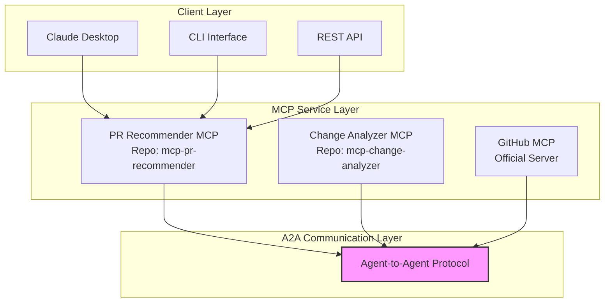
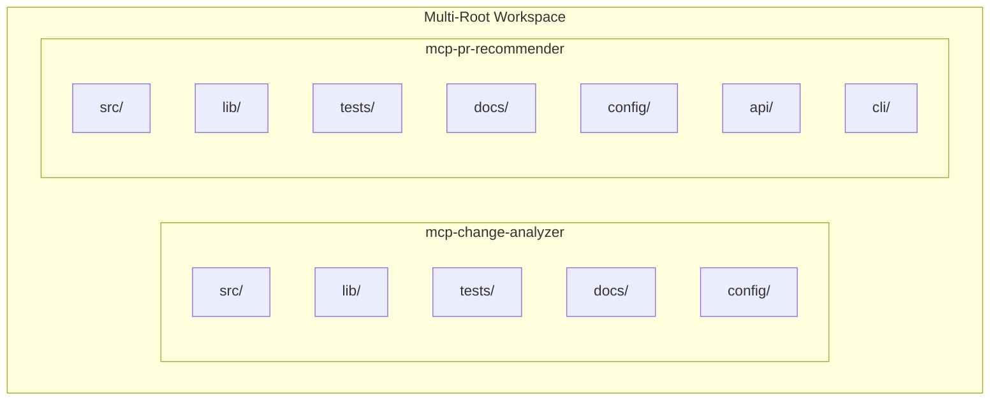

# Revised MCP Implementation Plan for PR Generator (A2A-Based Multi-Repo)

## Architecture Overview



## Multi-Root Workspace Structure

The project will be organized as a multi-root workspace with fully independent repositories:



## Repository Structure

The project will be split into completely independent repositories:

1. **mcp-change-analyzer**: Git change analysis MCP server (Agent)
2. **mcp-pr-recommender**: PR recommendation and generation MCP server (Agent and Primary Entry Point)

Each repository will be fully self-contained with its own implementation of common functionality to ensure true independence.

## Phase 1: Workspace and Repository Setup (Week 1)

### 1.1 Multi-Root Workspace Configuration

Create a VS Code multi-root workspace configuration file:

```json
// pr-generator.code-workspace
{
  "folders": [
    {
      "name": "Git Analyzer",
      "path": "../mcp-git-analyzer"
    },
    {
      "name": "PR Recommender",
      "path": "../mcp-pr-recommender"
    }
  ],
  "settings": {
    "python.linting.enabled": true,
    "python.linting.flake8Enabled": true,
    "python.formatting.provider": "black",
    "editor.formatOnSave": true,
    "editor.rulers": [88],
    "python.testing.pytestEnabled": true,
    "terminal.integrated.env.linux": {
      "PYTHONPATH": "${workspaceFolder}"
    }
  },
  "extensions": {
    "recommendations": [
      "ms-python.python",
      "ms-python.vscode-pylance",
      "ms-python.flake8",
      "ms-python.black-formatter",
      "ms-python.isort"
    ]
  }
}
```

### 1.2 Repository Creation

Initialize the two separate GitHub repositories with the following structure:

```bash
# mcp-change-analyzer
mcp-change-analyzer/
├── src/
│   ├── server.py                  # Main entry point with A2A integration
│   ├── tools/
│   │   ├── repo_analyzer.py       # Tool for analyzing repos
│   │   ├── change_detector.py     # Tool for detecting changes
│   │   └── metrics_collector.py   # Tool for collecting metrics
│   ├── resources/
│   │   ├── repo_structure.py      # Resource for repo structure
│   │   └── change_metadata.py     # Resource for change metadata
│   ├── services/
│   │   ├── git_service.py         # Git operations service
│   │   └── analysis_service.py    # Analysis service
│   ├── lib/                       # Self-contained library code (no shared dependencies)
│   │   ├── state/
│   │   │   └── manager.py         # State management
│   │   ├── error/
│   │   │   └── handler.py         # Error handling
│   │   ├── telemetry/
│   │   │   └── monitor.py         # Telemetry
│   │   └── models/
│   │       └── git_models.py      # Git-specific models
│   └── config/
│       └── loader.py              # Configuration loader
├── tests/
│   ├── unit/
│   └── integration/
├── docs/
│   ├── api.md                     # API documentation
│   └── usage.md                   # Usage documentation
├── config/
│   └── server.yaml                # Server configuration
├── pyproject.toml                 # Project configuration
├── requirements.txt               # Dependencies
├── requirements-dev.txt           # Development dependencies
├── .gitignore                     # Git ignore file
├── README.md                      # Project readme
└── setup.py                       # Package setup

# mcp-pr-recommender
mcp-pr-recommender/
├── src/
│   ├── server.py                  # Main entry point with A2A integration
│   ├── tools/
│   │   ├── grouper.py             # Tool for grouping files
│   │   ├── validator.py           # Tool for validating PRs
│   │   └── metadata_generator.py  # Tool for generating PR metadata
│   ├── resources/
│   │   ├── grouping_strategies.py # Resource for grouping strategies
│   │   └── pr_templates.py        # Resource for PR templates
│   ├── services/
│   │   ├── grouping_service.py    # Grouping service
│   │   └── validation_service.py  # Validation service
│   ├── lib/                       # Self-contained library code (no shared dependencies)
│   │   ├── state/
│   │   │   └── manager.py         # State management
│   │   ├── error/
│   │   │   └── handler.py         # Error handling
│   │   ├── telemetry/
│   │   │   └── monitor.py         # Telemetry
│   │   └── models/
│   │       └── pr_models.py       # PR-specific models
│   ├── api/
│   │   └── gateway.py             # API gateway
│   ├── cli/
│   │   └── pr_generator_cli.py    # CLI interface
│   └── config/
│       └── loader.py              # Configuration loader
├── tests/
│   ├── unit/
│   └── integration/
├── docs/
│   ├── api.md                     # API documentation
│   └── usage.md                   # Usage documentation
├── config/
│   └── server.yaml                # Server configuration
├── pyproject.toml                 # Project configuration
├── requirements.txt               # Dependencies
├── requirements-dev.txt           # Development dependencies
├── .gitignore                     # Git ignore file
├── README.md                      # Project readme
└── setup.py                       # Package setup
```

### 1.3 Setup Build System and Dependencies

Each repository will have its own complete setup:

1. Use `pyproject.toml` with Poetry for modern Python packaging
2. Define dependencies in `requirements.txt` for those who don't use Poetry
3. Configure development dependencies in `requirements-dev.txt`

Example `pyproject.toml` for mcp-change-analyzer:

```toml
[tool.poetry]
name = "mcp-change-analyzer"
version = "0.1.0"
description = "Git Change Analyzer MCP Server with A2A Protocol Support"
authors = ["Your Name <your.email@example.com>"]
readme = "README.md"

[tool.poetry.dependencies]
python = "^3.9"
fastmcp = "^0.1.0"
a2a-python = "^0.1.0"  # Google's A2A protocol library
pydantic = "^2.0.0"
gitpython = "^3.1.30"
redis = "^4.5.5"
fastapi = "^0.100.0"
uvicorn = "^0.22.0"
httpx = "^0.24.1"

[tool.poetry.group.dev.dependencies]
pytest = "^7.3.1"
black = "^23.3.0"
flake8 = "^6.0.0"
mypy = "^1.3.0"
isort = "^5.12.0"

[build-system]
requires = ["poetry-core"]
build-backend = "poetry.core.masonry.api"
```

## Phase 2: A2A Protocol Integration (Week 2)

### 2.1 Google A2A Protocol Implementation Strategy

Google's Agent-to-Agent (A2A) protocol enables structured communication between AI agents. The implementation strategy involves:

1. **Core A2A Integration**:
   - Implement A2A endpoints in each server
   - Create agent cards and WebFinger discovery
   - Implement request and response handling based on JSON-RPC

2. **Agent Execution Framework**:
   - Implement `AgentExecutor` for each server
   - Create `EventQueue` for handling responses
   - Support message type handling for various events

3. **Client-Side A2A Communication**:
   - Use A2A client library for inter-agent communication
   - Implement structured message passing

### 2.2 A2A Setup for Each Repository

#### Change Analyzer A2A Integration

```python
# mcp-change-analyzer/src/server.py
# (Similar to implementation in the plan with proper A2A handlers)

class ChangeAnalyzerServer:
    """Change Analyzer MCP Server implementation with A2A support"""

    def __init__(self, config_path="config/server.yaml"):
        """Initialize the server with configuration"""
        self.config = self._load_config(config_path)
        
        # Create FastMCP instance
        self.mcp = FastMCP(
            name=self.config.get('server', {}).get('name', 'change-analyzer'),
            instructions=self.config.get('server', {}).get('instructions', '')
        )
        
        # Initialize A2A components
        self.agent = ChangeAnalyzerAgent(self.config)
        self.agent_executor = ChangeAnalyzerExecutor(self.agent)
        
        # Register A2A endpoints
        self._register_a2a_endpoints()

    def _register_a2a_endpoints(self):
        """Register A2A endpoints for agent discovery and interaction"""
        @self.mcp.route("GET", "/.well-known/agent.json")
        async def agent_card():
            """Return the agent card with metadata"""
            return {
                "name": "Change Analyzer Agent",
                "description": "Analyzes Git repositories for changes",
                "endpoints": {"rpc": "/rpc"},
                "methods": ["analyze_repository", "get_repo_metrics"],
                "capabilities": {
                    "streaming": False,
                    "authentication": ["apiKey"],
                    "discovery": ["webfinger"]
                }
            }
        
        @self.mcp.route("GET", "/.well-known/webfinger")
        async def webfinger(resource: str, request_url: str):
            """WebFinger discovery endpoint"""
            return {
                "subject": resource,
                "links": [
                    {
                        "rel": "urn:ietf:params:xml:ns:lnkd:agent",
                        "href": f"{request_url.rstrip('/')}/agent.json"
                    }
                ]
            }
        
        @self.mcp.route("POST", "/rpc")
        async def rpc(request_body: dict):
            """Handle JSON-RPC requests"""
            # Extract request ID, method, and params
            request_id = request_body.get("id")
            method = request_body.get("method")
            params = request_body.get("params", {})
            
            # Create A2A request context
            context = RequestContext(request={"method": method, "params": params})
            event_queue = EventQueue()
            
            # Execute the request
            await self.agent_executor.execute(context, event_queue)
            
            # Collect events from queue
            events = []
            while not event_queue.empty():
                events.append(event_queue.dequeue_event())
            
            # Format response
            return {
                "jsonrpc": "2.0",
                "id": request_id,
                "result": {"events": events}
            }
```

#### PR Recommender A2A Integration

```python
# mcp-pr-recommender/src/server.py
# (Similar implementation with A2A client setup to talk to other agents)

class PRRecommenderServer:
    """PR Recommender MCP Server implementation with A2A support"""

    def __init__(self, config_path="config/server.yaml"):
        """Initialize the server with configuration"""
        self.config = self._load_config(config_path)
        
        # Create FastMCP instance
        self.mcp = FastMCP(
            name=self.config.get('server', {}).get('name', 'pr-recommender'),
            instructions=self.config.get('server', {}).get('instructions', '')
        )
        
        # Initialize A2A components
        self.agent = PRRecommenderAgent(self.config)
        self.agent_executor = PRRecommenderExecutor(self.agent)
        
        # Register A2A endpoints
        self._register_a2a_endpoints()
        
        # Initialize A2A clients
        self._initialize_a2a_clients()
    
    def _initialize_a2a_clients(self):
        """Initialize A2A clients for other agents"""
        self.change_analyzer_client = A2AClient(
            "change-analyzer",
            base_url=self.config.get('a2a', {}).get('known_servers', {}).get('change-analyzer')
        )
        
        self.github_client = A2AClient(
            "github",
            base_url=self.config.get('a2a', {}).get('known_servers', {}).get('github')
        )
```

## Phase 3: Code Migration and Refactoring (Week 2-3)

### 3.1 Implementing Independent Libraries

Instead of using a shared library, each repository will implement its own version of common functionality:

1. Each repo includes similar but independent implementations
2. Implement key components like state management, error handling, telemetry in each repo
3. Use similar interfaces but repository-specific implementations
4. Specialize the implementations for the specific needs of each service

### 3.2 Change Analyzer Migration

Migrate and refactor the Git analysis code:

1. Extract core Git operations from crewai_approach
2. Implement A2A-compatible interfaces
3. Implement repository-specific error handling and telemetry
4. Include all necessary Git analysis models directly in the repo

### 3.3 PR Recommender Migration

Migrate and refactor the PR recommendation code:

1. Extract grouping and validation logic
2. Implement A2A-compatible interfaces
3. Implement repository-specific state management
4. Implement API and CLI interfaces

## Phase 4: State Management and Configuration (Week 3)

### 4.1 State Management Implementation

Implement a Redis-based state manager in each repository:

```python
# mcp-change-analyzer/src/lib/state/manager.py and mcp-pr-recommender/src/lib/state/manager.py
import json
import logging
from typing import Dict, Any, Optional
import redis

class StateManager:
    """Manages workflow execution state using Redis"""

    def __init__(self, redis_url: str = "redis://localhost:6379"):
        """Initialize the State Manager with Redis connection"""
        self.redis = redis.from_url(redis_url)
        self.ttl = 3600  # 1 hour default TTL
        self.logger = logging.getLogger(__name__)

    async def save_workflow_state(self, workflow_id: str, state: Dict[str, Any]):
        """Save workflow execution state"""
        key = f"workflow:{workflow_id}"
        try:
            self.redis.setex(key, self.ttl, json.dumps(state))
            self.logger.debug(f"Saved state for workflow: {workflow_id}")
        except Exception as e:
            self.logger.error(f"Error saving state for workflow {workflow_id}: {e}")

    async def get_workflow_state(self, workflow_id: str) -> Optional[Dict[str, Any]]:
        """Retrieve workflow execution state"""
        key = f"workflow:{workflow_id}"
        try:
            data = self.redis.get(key)
            if data:
                return json.loads(data)
            return None
        except Exception as e:
            self.logger.error(f"Error getting state for workflow {workflow_id}: {e}")
            return None
```

### 4.2 Configuration Management

Create standardized configuration loading in each repository:

```python
# mcp-change-analyzer/src/config/loader.py and mcp-pr-recommender/src/config/loader.py
import os
import yaml
from typing import Dict, Any, Optional

class ConfigLoader:
    """Configuration loader for MCP servers"""

    def __init__(self, config_path: str = None):
        """Initialize with optional path to config file"""
        self.config_path = config_path or os.environ.get("CONFIG_PATH", "config/server.yaml")
        self.config = self._load_config()

    def _load_config(self) -> Dict[str, Any]:
        """Load configuration from YAML file"""
        try:
            with open(self.config_path, 'r') as f:
                return yaml.safe_load(f)
        except Exception as e:
            print(f"Error loading configuration: {e}")
            return {}

    def get(self, section: str, key: Optional[str] = None, default: Any = None) -> Any:
        """Get configuration value by section and optional key"""
        if section not in self.config:
            return default
        
        if key is None:
            return self.config[section]
        
        return self.config[section].get(key, default)
```

## Phase 5: API and Client Interfaces (Week 4)

### 5.1 REST API Gateway in PR Recommender

Implement a FastAPI-based API gateway:

```python
# mcp-pr-recommender/src/api/gateway.py
from fastapi import FastAPI, HTTPException, Depends, Security
from fastapi.security import HTTPBearer
from typing import Dict, Any, Optional
import json

app = FastAPI(title="PR Generator API")
security = HTTPBearer()

class APIGateway:
    """API Gateway for PR Recommender"""

    def __init__(self):
        """Initialize the API Gateway"""
        # Initialize A2A client to PR Recommender
        from a2a.client import A2AClient
        self.a2a_client = A2AClient("pr-recommender", base_url="http://localhost:8082")
    
    async def analyze_repository(self, repo_path: str, options: Dict[str, Any] = {}):
        """Analyze repository and generate PR suggestions"""
        response = await self.a2a_client.request({
            "method": "generate_prs_workflow",
            "params": {
                "repo_path": repo_path,
                "options": options
            }
        })
        
        # Process A2A response
        for event in response.get("events", []):
            if event.get("type") == "agent_text_message":
                try:
                    return json.loads(event.get("text", "{}"))
                except json.JSONDecodeError:
                    pass
        
        raise HTTPException(status_code=500, detail="Failed to process A2A response")
```

### 5.2 CLI Interface in PR Recommender

Implement a Click-based CLI interface:

```python
# mcp-pr-recommender/src/cli/pr_generator_cli.py
import click
import asyncio
import json
import sys

@click.group()
def cli():
    """PR Generator CLI"""
    pass

@cli.command()
@click.argument("repo_path", type=click.Path(exists=True))
@click.option("--output", "-o", type=click.Choice(["human", "json"]), default="human")
def analyze(repo_path, output):
    """Analyze repository and suggest PRs"""
    # Initialize A2A client
    from a2a.client import A2AClient
    a2a_client = A2AClient("pr-recommender", base_url="http://localhost:8082")
    
    # Make A2A request
    async def run():
        response = await a2a_client.request({
            "method": "generate_prs_workflow",
            "params": {
                "repo_path": repo_path
            }
        })
        
        # Process response
        for event in response.get("events", []):
            if event.get("type") == "agent_text_message":
                try:
                    result = json.loads(event.get("text", "{}"))
                    if output == "json":
                        click.echo(json.dumps(result, indent=2))
                    else:
                        _print_human_readable(result)
                    return
                except json.JSONDecodeError:
                    pass
        
        click.echo("Failed to get a valid response", err=True)
    
    asyncio.run(run())

def _print_human_readable(result):
    """Format result for human reading"""
    click.echo(f"Workflow ID: {result.get('workflow_id', 'N/A')}")
    click.echo(f"Status: {result.get('status', 'N/A')}")
    
    if result.get("status") == "completed":
        output = result.get("output", {})
        pr_groups = output.get("pr_groups", [])
        click.echo(f"\nFound {len(pr_groups)} potential PRs:")
        
        for i, group in enumerate(pr_groups):
            click.echo(f"\nPR {i+1}: {group.get('name', 'Untitled')}")
            click.echo(f"Files: {len(group.get('files', []))}")
            if "files" in group:
                for file in group["files"][:5]:  # Show first 5 files
                    click.echo(f"  - {file}")
                if len(group["files"]) > 5:
                    click.echo(f"  ... and {len(group['files']) - 5} more files")
```

## Phase 6: Error Handling and Observability (Week 4-5)

### 6.1 Error Handling

Implement repository-specific error handling:

```python
# mcp-change-analyzer/src/lib/error/handler.py and mcp-pr-recommender/src/lib/error/handler.py
from typing import Callable, Any, Type, Union, Tuple
import asyncio
from functools import wraps
import logging

class MCPError(Exception):
    """Base exception for MCP operations"""
    pass

class ToolExecutionError(MCPError):
    """Error during tool execution"""
    pass

class ConnectionError(MCPError):
    """MCP connection error"""
    pass

class A2AError(MCPError):
    """Error during A2A communication"""
    pass

class ErrorHandler:
    def __init__(self):
        self.logger = logging.getLogger(__name__)
        self.retry_config = {
            "max_attempts": 3,
            "backoff_factor": 2,
            "max_delay": 30
        }

    def with_retry(self, exceptions: Union[Type[Exception], Tuple[Type[Exception], ...]] = (Exception,)):
        """Decorator for automatic retry with exponential backoff"""
        def decorator(func: Callable) -> Callable:
            @wraps(func)
            async def wrapper(*args, **kwargs) -> Any:
                last_exception = None
                delay = 1

                for attempt in range(self.retry_config["max_attempts"]):
                    try:
                        return await func(*args, **kwargs)
                    except exceptions as e:
                        last_exception = e
                        if attempt < self.retry_config["max_attempts"] - 1:
                            self.logger.warning(
                                f"Attempt {attempt + 1} failed: {e}. Retrying in {delay}s"
                            )
                            await asyncio.sleep(delay)
                            delay = min(
                                delay * self.retry_config["backoff_factor"],
                                self.retry_config["max_delay"]
                            )
                        else:
                            self.logger.error(f"All attempts failed: {e}")

                raise last_exception
            return wrapper
        return decorator
```

### 6.2 Telemetry

Implement repository-specific telemetry:

```python
# mcp-change-analyzer/src/lib/telemetry/monitor.py and mcp-pr-recommender/src/lib/telemetry/monitor.py
from prometheus_client import Counter, Histogram, Gauge
import structlog
from opentelemetry import trace
from opentelemetry.exporter.otlp.proto.grpc.trace_exporter import OTLPSpanExporter
from typing import Callable, Any

class Telemetry:
    def __init__(self, server_name: str):
        self.server_name = server_name
        self.logger = structlog.get_logger()
        self.tracer = trace.get_tracer(__name__)

        # Metrics
        self.tool_calls = Counter(
            'mcp_tool_calls_total',
            'Total number of MCP tool calls',
            ['server_name', 'tool_name', 'status']
        )

        self.tool_duration = Histogram(
            'mcp_tool_duration_seconds',
            'Duration of MCP tool calls',
            ['server_name', 'tool_name']
        )

        # A2A specific metrics
        self.a2a_messages = Counter(
            'a2a_messages_total',
            'Total number of A2A messages',
            ['server_name', 'direction', 'message_type', 'status']
        )

        self.a2a_message_duration = Histogram(
            'a2a_message_duration_seconds',
            'Duration of A2A message processing',
            ['server_name', 'direction', 'message_type']
        )

    def track_tool_call(self, tool_name: str):
        """Decorator to track tool calls"""
        def decorator(func: Callable) -> Callable:
            async def wrapper(*args, **kwargs) -> Any:
                with self.tracer.start_as_current_span(f"tool:{tool_name}") as span:
                    span.set_attribute("tool.name", tool_name)
                    span.set_attribute("server.name", self.server_name)

                    with self.tool_duration.labels(
                        server_name=self.server_name,
                        tool_name=tool_name
                    ).time():
                        try:
                            result = await func(*args, **kwargs)
                            self.tool_calls.labels(
                                server_name=self.server_name,
                                tool_name=tool_name,
                                status="success"
                            ).inc()
                            span.set_status(trace.Status(trace.StatusCode.OK))
                            return result
                        except Exception as e:
                            self.tool_calls.labels(
                                server_name=self.server_name,
                                tool_name=tool_name,
                                status="error"
                            ).inc()
                            span.record_exception(e)
                            span.set_status(
                                trace.Status(trace.StatusCode.ERROR, str(e))
                            )
                            raise
            return wrapper
        return decorator

    def track_a2a_message(self, direction: str, message_type: str):
        """Decorator to track A2A messages"""
        def decorator(func: Callable) -> Callable:
            async def wrapper(*args, **kwargs) -> Any:
                with self.tracer.start_as_current_span(f"a2a:{direction}:{message_type}") as span:
                    span.set_attribute("a2a.direction", direction)
                    span.set_attribute("a2a.message_type", message_type)
                    span.set_attribute("server.name", self.server_name)

                    with self.a2a_message_duration.labels(
                        server_name=self.server_name,
                        direction=direction,
                        message_type=message_type
                    ).time():
                        try:
                            result = await func(*args, **kwargs)
                            self.a2a_messages.labels(
                                server_name=self.server_name,
                                direction=direction,
                                message_type=message_type,
                                status="success"
                            ).inc()
                            span.set_status(trace.Status(trace.StatusCode.OK))
                            return result
                        except Exception as e:
                            self.a2a_messages.labels(
                                server_name=self.server_name,
                                direction=direction,
                                message_type=message_type,
                                status="error"
                            ).inc()
                            span.record_exception(e)
                            span.set_status(
                                trace.Status(trace.StatusCode.ERROR, str(e))
                            )
                            raise
            return wrapper
        return decorator
```

## Phase 7: Testing and Integration (Week 5+)

### 7.1 Unit Testing

Implement unit tests for all components:

```python
# Example test in mcp-change-analyzer/tests/unit/test_git_service.py
import pytest
from unittest.mock import patch
from src.services.git_service import GitService

class TestGitService:
    def setup_method(self):
        self.git_service = GitService({"test": True})

    @patch("src.services.git_service.git.Repo")
    def test_get_changes(self, mock_repo):
        # Test implementation
        pass
```

### 7.2 Integration Testing

Implement integration tests for A2A communication:

```python
# Example test in mcp-pr-recommender/tests/integration/test_a2a_communication.py
import pytest
import asyncio
from a2a.client import A2AClient
from src.server import PRRecommenderServer

class TestA2ACommunication:
    @pytest.fixture
    async def server(self):
        server = PRRecommenderServer("tests/fixtures/test_config.yaml")
        # Start server in background
        task = asyncio.create_task(server.run())
        yield server
        # Clean up
        task.cancel()
    
    async def test_a2a_request(self, server):
        # Test implementation for A2A communication
        pass
```

### 7.3 End-to-End Testing

Implement end-to-end tests for the full workflow:

```python
# Example test in mcp-pr-recommender/tests/e2e/test_workflow.py
import pytest
import tempfile
import os
import git
from src.cli.pr_generator_cli import analyze

class TestWorkflow:
    @pytest.fixture
    def test_repo(self):
        with tempfile.TemporaryDirectory() as tmp_dir:
            # Set up test repo with changes
            repo = git.Repo.init(tmp_dir)
            with open(os.path.join(tmp_dir, "test.txt"), "w") as f:
                f.write("Initial content")
            repo.git.add("test.txt")
            repo.git.commit("-m", "Initial commit")
            
            # Make changes
            with open(os.path.join(tmp_dir, "test.txt"), "w") as f:
                f.write("Updated content")
            
            yield tmp_dir
    
    def test_analyze_command(self, test_repo, capsys):
        # Run CLI command
        analyze(test_repo, "human")
        
        # Check output
        captured = capsys.readouterr()
        assert "Workflow ID:" in captured.out
        assert "Status: completed" in captured.out
```

## Phase 8: Documentation and Deployment (Week 6)

### 8.1 Documentation

Create comprehensive documentation for each repository:

1. **README.md**: Include project overview, installation instructions, usage examples, and contribution guidelines
2. **API Documentation**: Document all available endpoints, parameters, and response formats
3. **Architecture Diagrams**: Create visual representations of the system architecture
4. **Development Guide**: Provide instructions for setting up a development environment

Example README.md structure:

```markdown
# Change Analyzer MCP Server

An Agent-to-Agent (A2A) compatible server for Git repository analysis.

## Features

- Analyze Git repositories for changes
- Provide metrics and statistics about repositories
- Analyze directory structures
- A2A protocol integration for agent communication

## Installation

### Prerequisites

- Python 3.9+
- Redis (for state management)

### Using pip

```bash
pip install mcp-change-analyzer
```

### From source

```bash
git clone https://github.com/your-org/mcp-change-analyzer.git
cd mcp-change-analyzer
pip install -e .
```

## Usage

### Starting the server

```bash
mcp-change-analyzer serve --config config/server.yaml
```

### Using the A2A API

Send A2A requests to the server's RPC endpoint:

```python
from a2a.client import A2AClient

async def analyze_repo():
    client = A2AClient("change-analyzer", base_url="http://localhost:8081")
    response = await client.request({
        "method": "analyze_repository",
        "params": {
            "repo_path": "/path/to/repo"
        }
    })
    print(response)
```

## Configuration

The server is configured using YAML files. See `config/server.yaml` for an example.

## License

MIT
```

### 8.2 Deployment Configuration

Create deployment configurations for each repository:

1. **Docker Compose**: For local development and testing
2. **Kubernetes Manifests**: For production deployment
3. **CI/CD Pipeline**: For automated testing and deployment

Example Docker Compose file:

```yaml
# docker-compose.yml
version: '3.8'

services:
  change-analyzer:
    build:
      context: .
      dockerfile: Dockerfile
    ports:
      - "8081:8081"
    environment:
      - CONFIG_PATH=/app/config/server.yaml
      - REDIS_URL=redis://redis:6379
    volumes:
      - ./config:/app/config
    depends_on:
      - redis
  
  pr-recommender:
    build:
      context: .
      dockerfile: Dockerfile
    ports:
      - "8082:8082"
    environment:
      - CONFIG_PATH=/app/config/server.yaml
      - REDIS_URL=redis://redis:6379
      - CHANGE_ANALYZER_URL=http://change-analyzer:8081
    volumes:
      - ./config:/app/config
    depends_on:
      - redis
      - change-analyzer
  
  redis:
    image: redis:alpine
    ports:
      - "6379:6379"
```

Example Kubernetes manifest:

```yaml
# kubernetes/change-analyzer-deployment.yaml
apiVersion: apps/v1
kind: Deployment
metadata:
  name: change-analyzer
  labels:
    app: change-analyzer
spec:
  replicas: 2
  selector:
    matchLabels:
      app: change-analyzer
  template:
    metadata:
      labels:
        app: change-analyzer
    spec:
      containers:
      - name: change-analyzer
        image: your-registry/mcp-change-analyzer:latest
        ports:
        - containerPort: 8081
        env:
        - name: CONFIG_PATH
          value: /app/config/server.yaml
        - name: REDIS_URL
          value: redis://redis-service:6379
        volumeMounts:
        - name: config-volume
          mountPath: /app/config
      volumes:
      - name: config-volume
        configMap:
          name: change-analyzer-config
---
apiVersion: v1
kind: Service
metadata:
  name: change-analyzer-service
spec:
  selector:
    app: change-analyzer
  ports:
  - port: 8081
    targetPort: 8081
  type: ClusterIP
```

## Conclusion

This implementation plan provides a roadmap for migrating the PR Generator project to a multi-repo architecture with A2A protocol integration. The key benefits of this approach include:

1. **Independent Repositories**: Each server is fully self-contained, allowing for independent development, versioning, and deployment.

2. **A2A Protocol Integration**: The Google Agent-to-Agent protocol enables standardized communication between AI agents, making it easier to connect with other A2A-compatible systems.

3. **Improved Modularity**: The new architecture separates concerns, with each repository focusing on a specific domain (Git analysis or PR recommendation).

4. **Maintainability**: By removing shared dependencies, each repository can evolve independently without affecting others.

5. **Scalability**: The independent nature of the repositories allows for scaling each component separately based on demand.

The implementation follows best practices for Python projects, including proper packaging, testing, documentation, and deployment configuration. By following this plan, the PR Generator will become more modular, maintainable, and aligned with modern agent communication standards.
